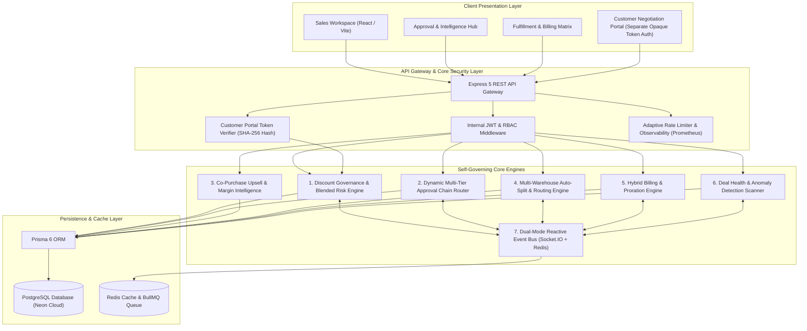
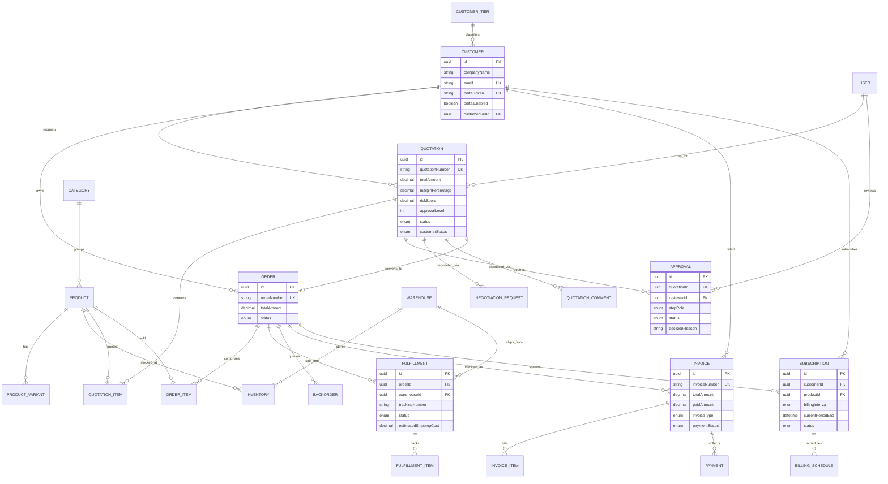
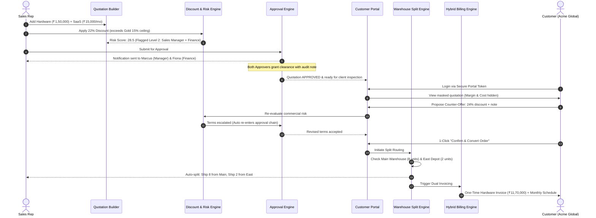

# DealFlow360: One-Page Architecture Diagram & System Design

> **An Intelligent, Self-Governing Sales Operations Platform**  
> *End-to-End Quotation-to-Cash with Blended Risk Governance, Multi-Warehouse Split Routing, Hybrid Billing, and Live Customer Negotiation.*

---

## 1. High-Level System Architecture

---

## 2. Core Relational Data Model (ER Diagram)

The data model enforces relational consistency between commercial negotiation, inventory reality, and financial reconciliation on a unified contract.

---

## 3. The 7 Major Business Engines & Communication Flow

---

## 4. Key Architectural Highlights

1. **Self-Governing Blended Risk Formulation**:
   $$\text{Risk Score} = \sum_{\text{lines}} \left( \frac{\text{Line Amount}}{\text{Total Amount}} \times \max(0, \text{Discount}_{\text{given}} - \text{Ceiling}_{\text{category}}) \right) \times \text{Tier Multiplier}$$
   Stops sales reps from distributing small margin erosions across multiple lines without detection.
2. **Zero-Trust Portal Isolation**:
   Customer Portal runs on opaque 256-bit SHA-256 tokens completely decoupled from internal employee JWTs. Sensitive internal costs, profit margins, and risk scores are physically omitted from portal API queries.
3. **Inventory-Aware Splitting**:
   Greedy Knapsack heuristic prioritizes primary warehouse fulfillment to minimize shipping parcels and costs, automatically generating FIFO backorder queues if aggregate inventory is insufficient.
4. **Hybrid Ledger Reconciliation**:
   Hardware capital expense and recurring software subscriptions live on the same deal, maintaining distinct revenue recognition schedules and proration ledgers.
